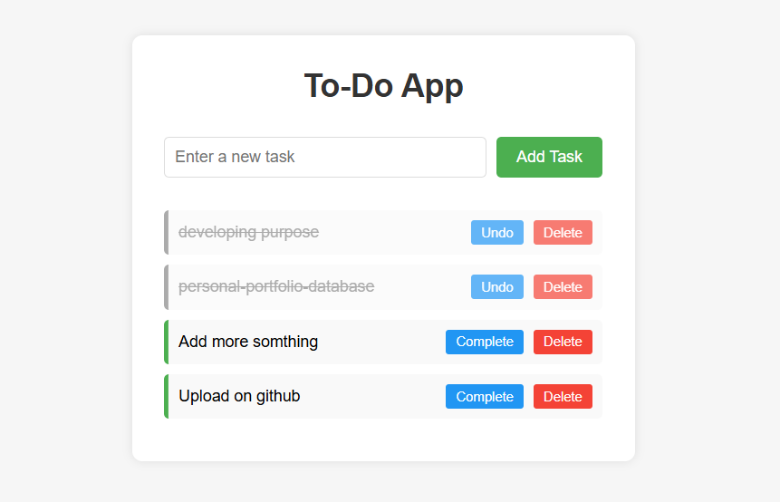

# 📝 To-Do App

A simple **To-Do application** built with **HTML**, **CSS**, and **JavaScript**.  
Users can add, edit, delete, and mark tasks as complete. Tasks are saved in the browser's **local storage** so they persist even after reloading.

---

## 🌐 Live Demo  
[🚀 Click here to try the To-Do App](https://dailycodesnippets.github.io/todo-app/)

---

## 🚀 Features
- ✅ **Add new tasks**
- ✏ **Edit existing tasks**
- ❌ **Delete tasks**
- ✔ **Mark tasks as completed**
- 💾 **Tasks saved in browser's local storage**
- 📱💻 **Responsive design** (works on mobile & desktop)

---

## 📸 Screenshot


---

## 📦 Installation & Usage

**1️⃣ Clone this repository**
```bash
git clone https://github.com/DailyCodeSnippets/todo-app.git
